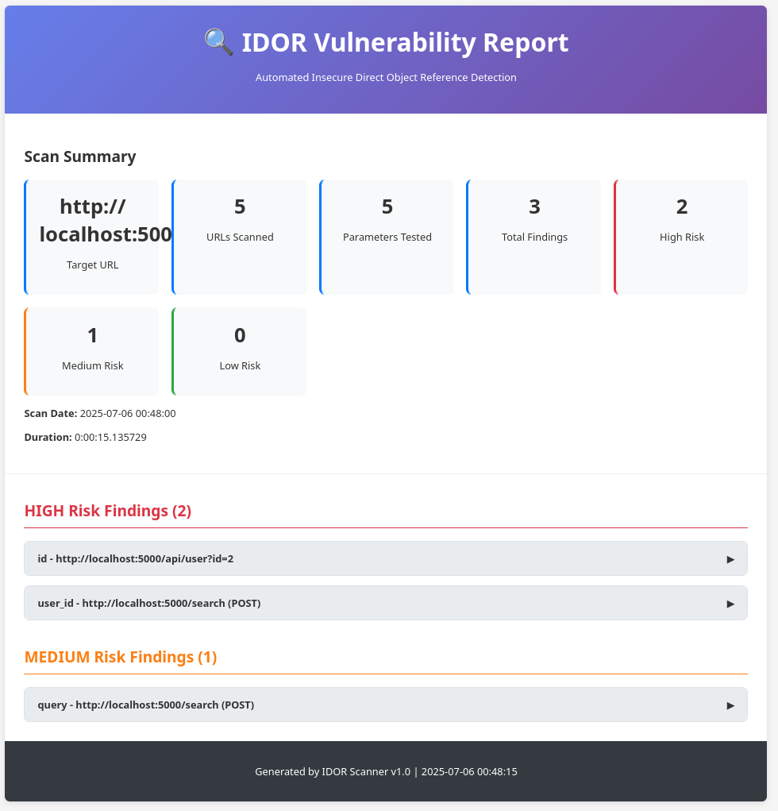

# Demo & Testing

This directory contains demonstration materials and testing utilities for the IDOR Scanner.

## Sample Report


## Contents

### Test Server (`test_server.py`)
A Flask-based vulnerable web application specifically designed to test IDOR vulnerability detection:

- **User API Endpoint**: `/api/user?id=1` - Access user profiles by ID
- **Document Access**: `/document/1` - Access documents by numeric ID
- **Admin Panel**: `/admin?user_id=2` - Admin functionality with user context
- **File Download**: `/download?file=report_1.pdf` - File access by filename
- **Search Form**: `/search` - POST form with hidden user_id parameter

**WARNING**: This server contains intentional vulnerabilities and should only be used for testing purposes.

### Test Scanner (`test_scanner.py`)
A debugging utility for testing parameter detection capabilities against various URL patterns.

### Reports Directory (`reports/`)
Contains example scan reports demonstrating the scanner's output formats:

- HTML reports with interactive UI
- JSON reports for programmatic analysis
- CSV reports for spreadsheet analysis

## Running the Demo

### Start the Test Server
```bash
uv run python demo/test_server.py
```
The server will be available at `http://localhost:5000`

### Scan the Test Server
```bash
# Basic scan
./idor_scanner -u http://localhost:5000 --min-score 1

# Comprehensive scan with multiple report formats
./idor_scanner -u http://localhost:5000 \
               --min-score 1 \
               --max-depth 2 \
               --rate-limit 0.3 \
               --reports html,json,csv
```

### Expected Results
The scanner should detect several IDOR vulnerabilities:

1. **High Risk**: User ID parameter in `/api/user?id=1`
2. **High Risk**: Hidden user_id field in search form
3. **Medium Risk**: Document ID in `/document/1`
4. **Medium Risk**: File parameter in download endpoint
